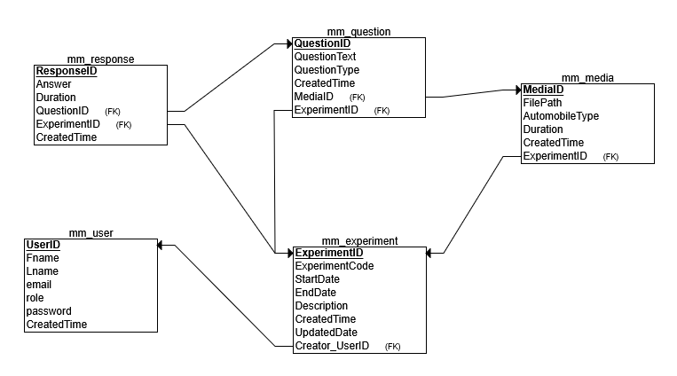

# VehicleSound-AnnoyanceSurveyApp

A web-based application to collect and analyze human perception of vehicle sound annoyance.

## Project Overview

The VehicleSound-AnnoyanceSurveyApp is a web-based platform designed to collect and analyze public perception of different vehicle sounds (cars, motorcycles, trucks, and others).
Participants listen to sound samples, classify the type of vehicle, and rate the perceived loudness or annoyance level. Responses are collected anonymously and securely stored for analysis.
## Technology Stack

- **Backend:** Python (Flask)
- **Frontend:** HTML, CSS
- **Database:** MySQL

## Users table

|Username |Password |
|---------|---------|
|r.ruta@d.com|pass123|

## User logins
- Administrator: 
    - Authenticated access upon login with email and password.
    - Manages users, experiments, questions, and media files.
    - Views and analyzes collected responses.
- Survey Participant
    - Accesses experiments anonymously through a link.
    - No registration or login required.
    - Listens to media, answers questions, and submits responses.

## User Credentials
- Users authenticate using their email address and password.
- Email: Serves as a unique identifier for each user.
- Password: Must be at least 3 characters long.
- The password is securely stored by hashing it with MD5.

## Authentication Process
- Registration: Users create an account by providing their email and setting a password.
- The system ensures the password meets the minimum length of 3 characters and is re-entered correctly to prevent errors.
- Passwords are hashed using MD5 before they are stored in the database for security.
- Login: Users log in by entering their email and password.
- The system validates the email and compares the entered password with the MD5 hashed password stored in the database.
- If the credentials are correct, a session is created to track the user’s activity throughout their session.
## Session Management:
- Upon successful login, a session is initiated to monitor the user's interactions with the application and remains active for 500seconds.

## Relational diagram

- An Experiment is created by an Administrator.
- An Experiment has multiple Questions.
- A Question can be associated with a Media file.
- Participants' Responses link to both Questions and Experiments
